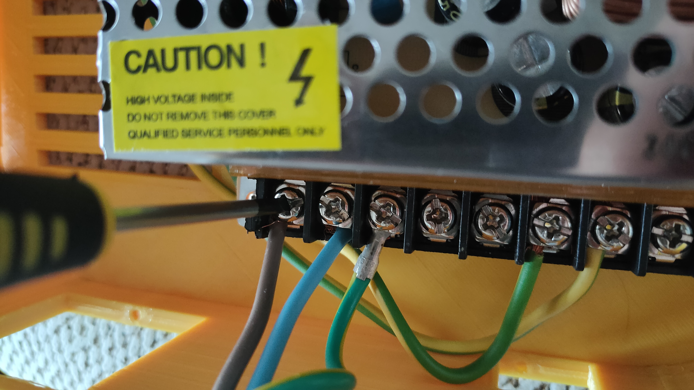
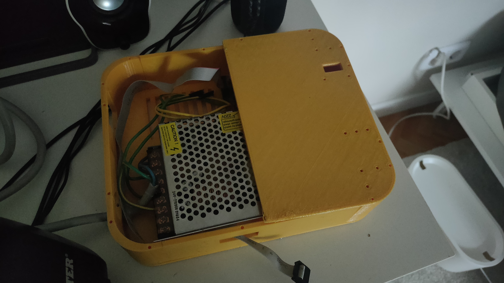
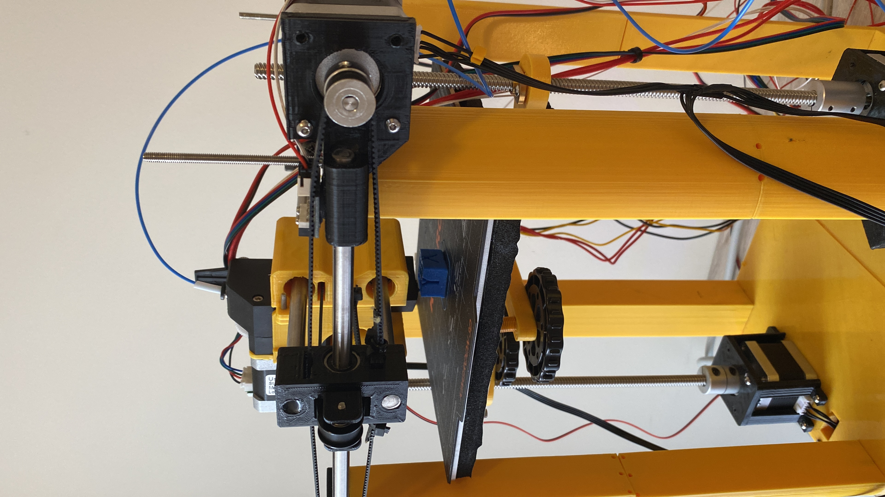
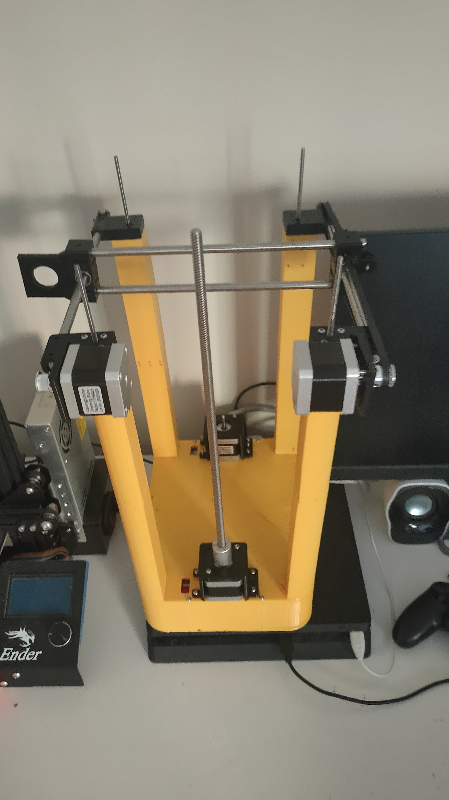

# CoreXY 3D Printer — Built From Scratch on a €120 Budget

> Designing a complete 3D printer from a blank sheet of paper: new CoreXY kinematics, a moving heated bed on twin Z lead-screws, a recycled Creality mainboard reflashed to fit, and a chassis that went from all-plastic to aluminium after the first version flexed too much.

*The starting point: the whole machine sketched by hand on graph paper — frame, CoreXY gantry, belt path and Z bed.*

---

## The idea

I wanted to build a 3D printer **from scratch** — not assemble a kit — to really understand motion systems, firmware and machine design. The rules I set myself:

- **Hard budget: under €120.** Recycle and reuse as much as possible.
- **Reuse the electronics** from my old Creality printer (its **Creality 4.2.7 silent mainboard**) instead of buying a new controller.
- **Different kinematics from what I knew.** My old Creality was a "bed-slinger" (the bed moves on Y). I wanted a **CoreXY** system, where the toolhead moves in X and Y via two belts and two fixed motors, and the **heated bed moves up and down on Z**.

## From sketch to CAD

Every part was modelled in **Fusion 360** before printing. I designed the frame, the CoreXY gantry, the motor mounts and the Z bed carriage from scratch.

<table>
<tr>
<td align="center"> NEMA stepper mount — CAD next to the real motor to check the fit</td>
<td align="center"> Z bed carriage on twin lead-screws, driven by two steppers — modelled in Fusion 360</td>
</tr>
</table>

## The printed chassis (v1 — all plastic)

The first full chassis was **entirely 3D-printed** in yellow PLA — frame legs, base shell and brackets. It worked, but under load the printed frame flexed more than I wanted.

<table>
<tr>
<td align="center"> A printed structural column with its threaded rod</td>
<td align="center"> Printed base panels + black reinforcement brackets</td>
<td align="center"> Printed base/enclosure shell with vents</td>
</tr>
</table>

*Version 1 assembled: fully 3D-printed base and uprights, with a NEMA stepper and Z lead-screw fitted.*

### The key iteration

Version 1 taught me the most important lesson: **a fully printed frame isn't stiff enough.** So I redesigned the machine around a **full aluminium-extrusion frame with 3D-printed reinforcements** at the joints and corners — keeping printed parts where they add value (brackets, mounts, covers) and letting aluminium carry the loads.

## Power & electronics

- **Controller:** recycled **Creality 4.2.7** board.
- **Firmware:** reflashed and reconfigured for the new machine — **CoreXY kinematics**, new axis directions, steps/mm, endstop positions and a moving-Z heated bed. The motion is nothing like the stock Creality config.
- **Power:** a dedicated mains PSU feeding the bed and electronics, mounted inside the printed base.

<table>
<tr>
<td align="center"> Mains PSU wired in — live / neutral / earth</td>
<td align="center"> High-voltage terminals — kept isolated inside the frame</td>
<td align="center"> PSU mounted inside the printed base with its cover</td>
</tr>
</table>

## Motion system — CoreXY + Z bed

<table>
<tr>
<td align="center"> CoreXY gantry — printed carriage, GT2 belts, linear rods and fixed NEMA motors</td>
<td align="center"> Heated bed assembly on printed mounts, moving on Z</td>
</tr>
</table>

## The machine

<table>
<tr>
<td align="center"> Assembled — twin Z lead-screws, steppers and the Ender LCD driving it</td>
<td align="center"> CoreXY gantry on top of the frame, bed driven on Z</td>
</tr>
</table>

## Specs at a glance

| Item | Detail |
|---|---|
| Motion system | CoreXY (X/Y), heated bed on twin-Z lead-screws |
| Controller | Creality 4.2.7 (recycled) + custom firmware config |
| Frame | v1: fully 3D-printed → v2: aluminium extrusion + printed reinforcements |
| Motion hardware | Linear rails, steel rods + bearings, GT2 belts & pulleys |
| Endstops | Mechanical limit switches |
| Power | Dedicated mains PSU |
| CAD | Fusion 360 |
| Budget | **< €120** |

## What I learned

- How **CoreXY kinematics** actually work, and how to configure firmware for a motion system from zero (axis mapping, steps/mm, homing, endstops).
- **Structural stiffness matters more than part count** — the jump from printed to aluminium frame was the difference between "moves" and "prints well."
- Safe integration of **mains power** into a machine.
- Reusing and reflashing existing electronics to hit a tight budget.

## Media

All photos are in this folder at full resolution — feel free to edit them.
