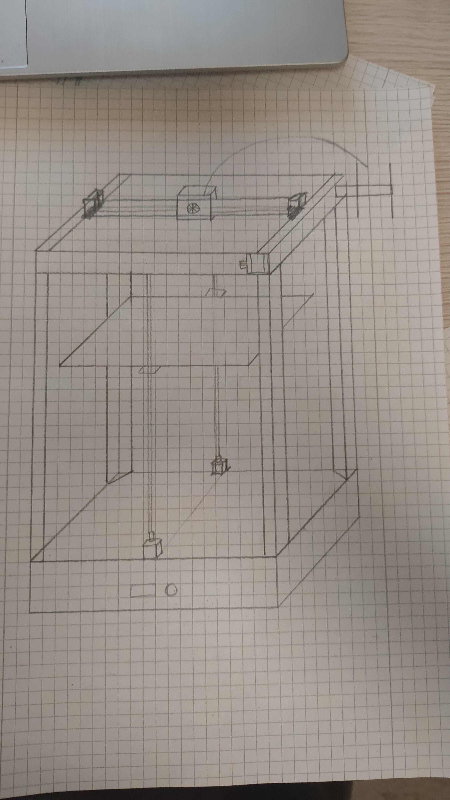
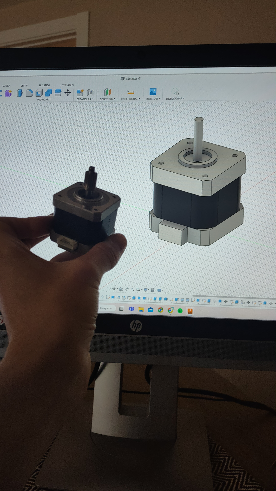
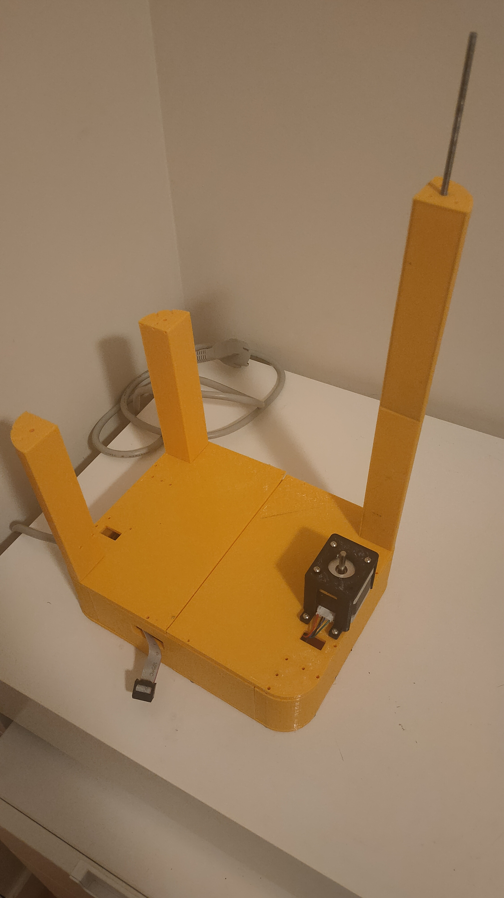
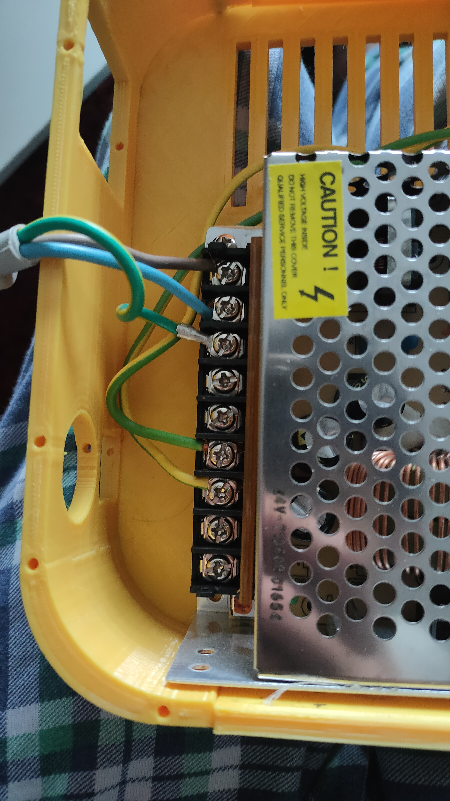
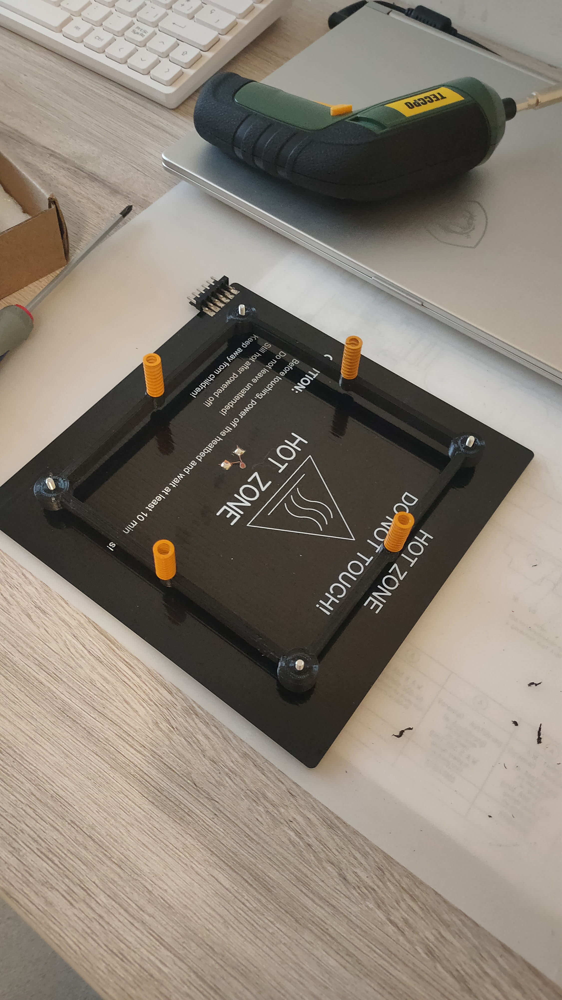
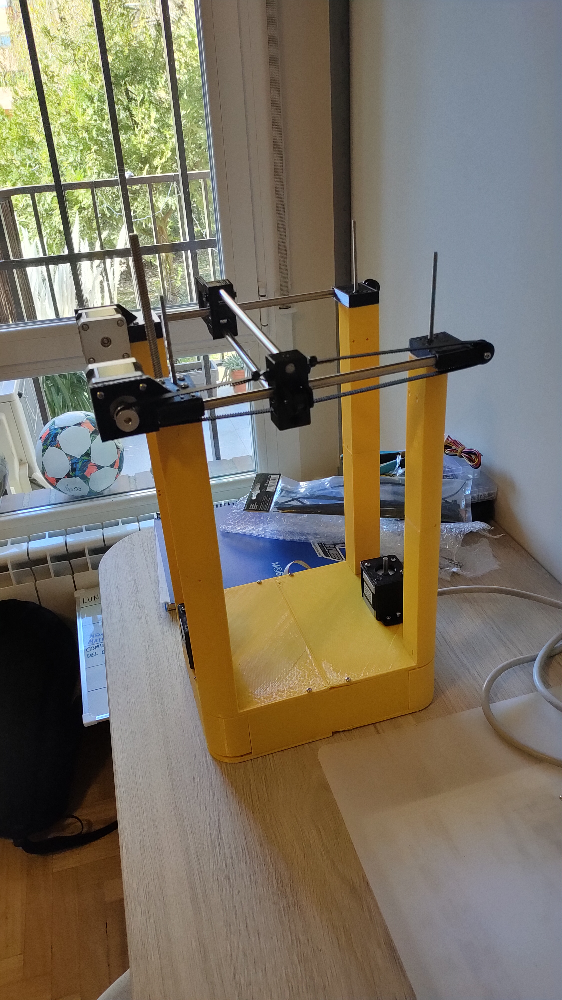

# CoreXY 3D Printer — Built From Scratch on a €120 Budget

> Designing a complete 3D printer from a blank sheet of paper: new CoreXY kinematics, a moving heated bed, a recycled Creality mainboard reflashed to fit, and a chassis that went from all-plastic to aluminium after the first version flexed too much.

*The starting point: the whole machine sketched by hand on graph paper — frame, CoreXY gantry, belt path and Z bed.*

---

## The idea

I wanted to build a 3D printer **from scratch** — not assemble a kit — to really understand motion systems, firmware and machine design. The rules I set myself:

- **Hard budget: under €120.** Recycle and reuse as much as possible.
- **Reuse the electronics** from my old Creality printer (its **Creality 4.2.7 silent mainboard**) instead of buying a new controller.
- **Different kinematics from what I knew.** My old Creality was a "bed-slinger" (the bed moves on Y). I wanted a **CoreXY** system, where the toolhead moves in X and Y via two belts and two fixed motors, and the **heated bed moves up and down on Z**. Completely different motion design.

## What I bought vs. recycled

| Recycled (from old Creality) | Bought new (within budget) |
|---|---|
| Creality 4.2.7 mainboard | Linear rails / guides |
| Stepper motors & PSU-side parts | Aluminium extrusion profiles |
| Hotend / small hardware | Linear steel rods for bearings |
| — | GT2 belts & pulleys |
| — | Endstops (limit switches) |
| — | Mains power supply unit |

## Design → CAD → build

*Every part modelled in Fusion 360 (`3dprinter v7`). Here, a NEMA stepper CAD next to the real motor to check the mounting.*

I designed every custom part in **Fusion 360** and printed them myself. The first full chassis was **entirely 3D-printed plastic** — no aluminium.

*Version 1: fully 3D-printed base and uprights. It worked, but under load the printed frame flexed more than I wanted — not rigid enough for clean prints.*

### The key iteration

Version 1 taught me the most important lesson: **a fully printed frame isn't stiff enough.** So I redesigned the machine around a **full aluminium-extrusion frame with 3D-printed reinforcements** at the joints and corners — keeping the printed parts where they add value (brackets, mounts, covers) and letting aluminium carry the loads.

## Electronics & power

*Mains PSU wired into the printed base (live / neutral / earth). Safety first — high-voltage section kept isolated inside the frame.*

- **Controller:** recycled **Creality 4.2.7** board.
- **Firmware:** reflashed and reconfigured for the new machine — **CoreXY kinematics**, new axis directions, steps/mm, endstop positions and a moving-Z heated bed. This was a big part of the project: the motion is nothing like the stock Creality config.
- **Power:** dedicated mains power supply feeding the bed and electronics.

*The heated bed assembly ("HOT ZONE") on printed spring mounts, moving vertically on Z.*

## The machine

*The assembled printer: CoreXY gantry on top (linear rods, GT2 belts, toolhead carriage, two fixed NEMA motors) over the frame, with the bed driven on Z.*

## Specs at a glance

| Item | Detail |
|---|---|
| Motion system | CoreXY (X/Y), heated bed on Z |
| Controller | Creality 4.2.7 (recycled) + custom firmware config |
| Frame | v1: fully 3D-printed → v2: aluminium extrusion + printed reinforcements |
| Motion hardware | Linear rails, steel rods + bearings, GT2 belts & pulleys |
| Endstops | Mechanical limit switches |
| Power | Dedicated mains PSU |
| CAD | Fusion 360 |
| Budget | **< €120** |

## What I learned

- How **CoreXY kinematics** actually work, and how to configure firmware for a motion system from zero (axis mapping, steps/mm, homing, endstops).
- **Structural stiffness matters more than part count** — the jump from printed to aluminium frame was the difference between "moves" and "prints well."
- Safe integration of **mains power** into a machine.
- Reusing and reflashing existing electronics to hit a tight budget.

## Media

All photos live in this folder at full resolution — feel free to edit them.
