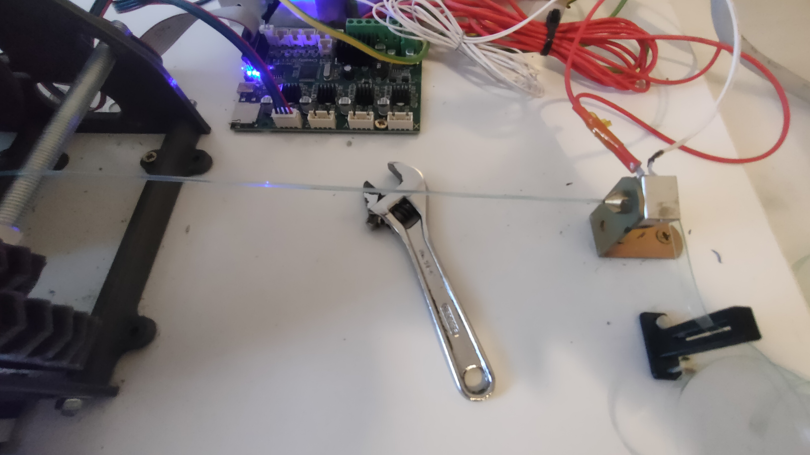
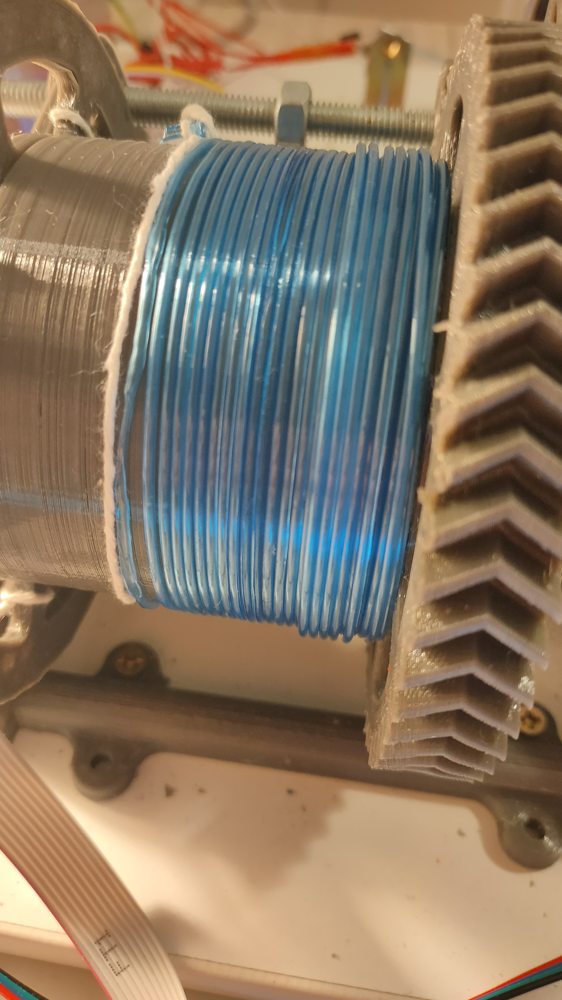
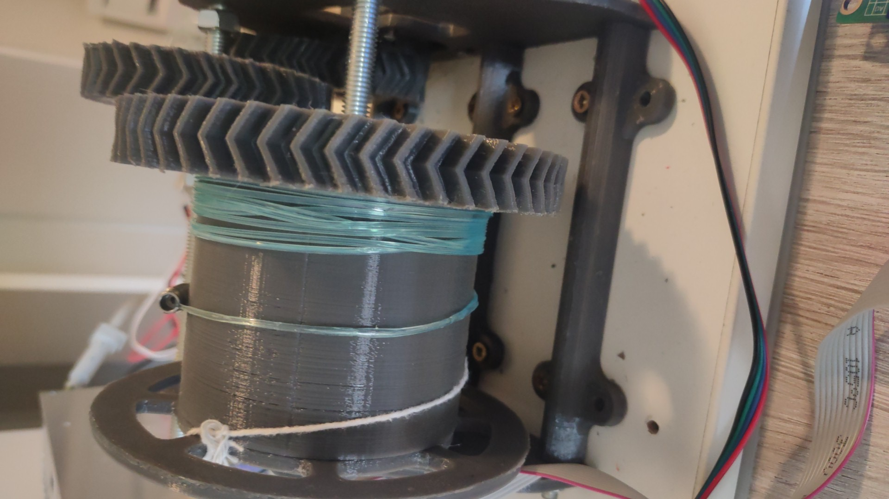
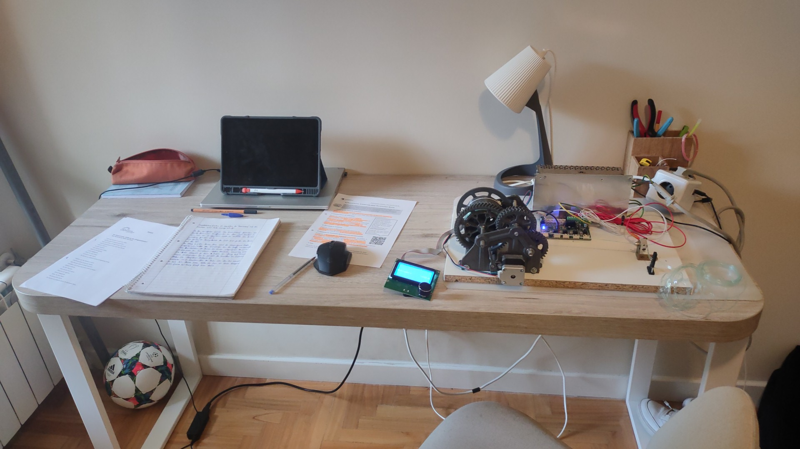
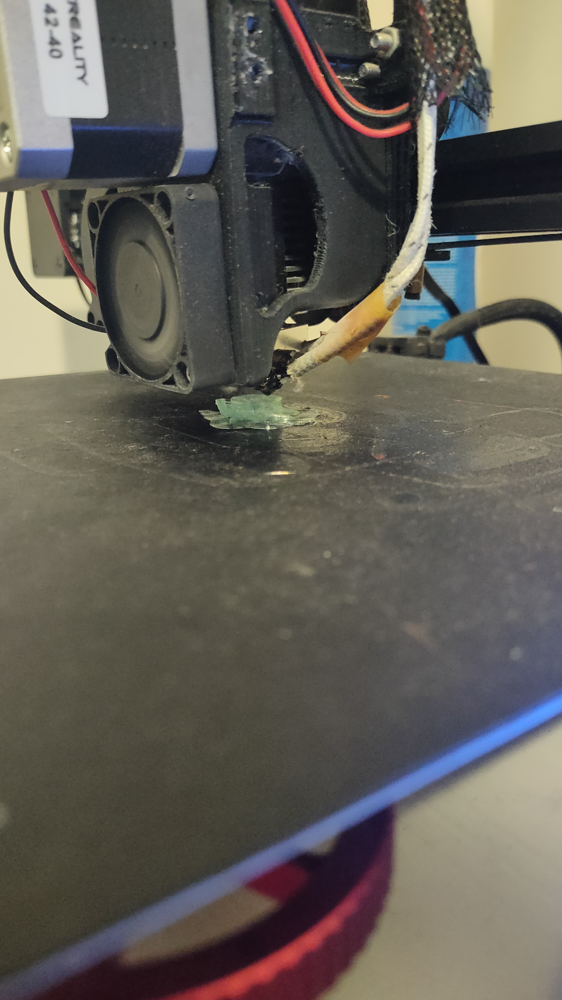
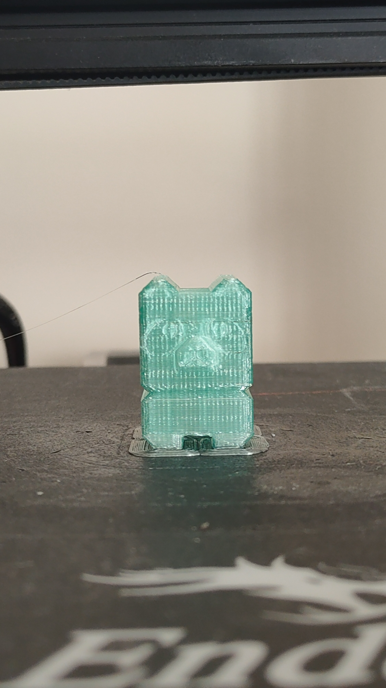
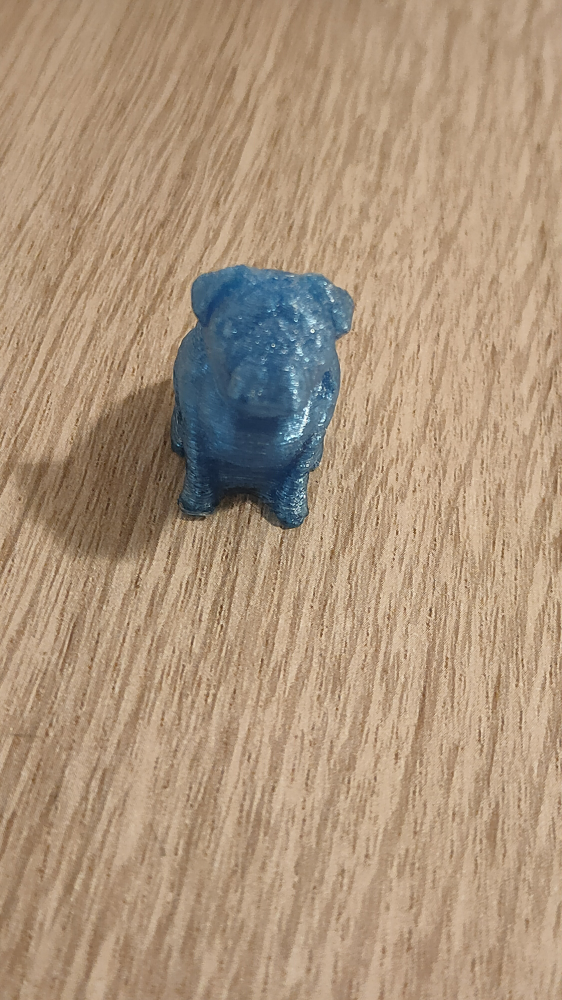

# PET Filament Recycler — Turning Bottles Into 3D-Printing Filament

> A machine that closes the loop on 3D printing: slice a plastic bottle into one long strip, pull it through a **modified hotend**, and wind out usable filament to print real parts with.


*The core of the machine: a continuous PET strip (cut from a bottle) is drawn through a **modified 3D-printer hotend** and reshaped by heat into round filament.*

---

## The idea

3D-printing filament is bought new and thrown away as failed prints and supports. **PET bottles** are everywhere and are the same family of plastic used in some filaments. I wanted to build a machine that **recycles PET bottles directly into printable filament** — and then actually print with the result.

## How it works

1. **Cut** — a plastic bottle is sliced into one long, continuous **strip** of even width.
2. **Heat & reshape** — the strip passes through a **modified 3D-printer hotend**: the heated nozzle sizes the plastic down into a round ~1.75 mm filament as it goes through.
3. **Pull & wind** — on the other side, a **motor drives a large 3D-printed reduction gear** that turns a drum. The drum pulls the strip through the hot zone at a steady rate and winds the finished filament onto itself.
4. **Control** — a repurposed **3D-printer control board + LCD** drives the puller motor and the hotend temperature.
5. **Print** — the recycled filament is then loaded into a normal 3D printer and used to print PET parts.

```
PET bottle  →  cut into strip  →  [ modified hotend, heated ]  →  motor + geared drum  →  wound filament  →  3D printer
```

## The machine

<table>
<tr>
<td align="center"><br><sub>Drum winding recycled PET filament, driven by a printed reduction gear</sub></td>
<td align="center"><br><sub>Printed herringbone reduction gears + the filament drum</sub></td>
<td align="center"><br><sub>Full setup: gears, control board and LCD on the bench</sub></td>
</tr>
</table>

## The result — printing with recycled filament

<table>
<tr>
<td align="center"><br><sub>Printing on the Ender with the recycled PET filament</sub></td>
<td align="center"><br><sub>A test model printed from recycled PET</sub></td>
<td align="center"><br><sub>Finished print — straight from a bottle</sub></td>
</tr>
</table>

## What I designed and built

- A **cutting method** to turn a bottle into a uniform continuous strip.
- A **modified hotend** reworked so a bottle strip (not standard 1.75 mm filament) can pass through and be reshaped by heat.
- A **motorised, geared puller**: 3D-printed reduction gears turning a drum, so the strip is drawn through the hot zone at a controlled, steady rate.
- **Electronics**: a repurposed 3D-printer control board and LCD to run the motor and regulate the hotend temperature.

## What I learned

- **Thermal + speed control is the whole game.** Pull too fast and the plastic doesn't reshape; too slow and it degrades. A steady, geared feed rate is what makes it work.
- **Designing printed gears that survive load** — herringbone reduction gears to get torque to the drum.
- **Closing the loop**: recycling a waste material back into a useful engineering input, and proving it by printing real parts with the output.

## Media

All photos are in this folder at full resolution.
