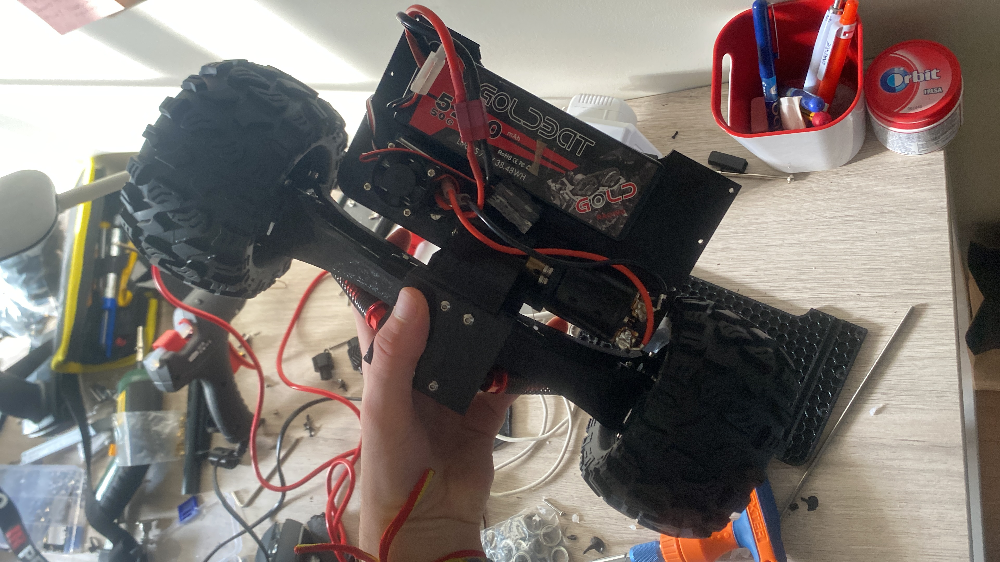

# Custom RC Car — Designed in Fusion 360, With a Self-Designed Gearbox

> After 3D-printing a couple of existing RC car models, I wanted a **bigger project**: to design my own car and really understand vehicle geometry — suspension, drivetrain and a reduction gearbox I designed from scratch.

*The build: a custom 3D-printed chassis carrying a brushless motor, LiPo battery and off-road tires.*

---

## Why I built it

I had already printed a few RC cars from existing designs. That was fun, but I was following someone else's geometry. I wanted to **design one myself** to understand *why* the parts are shaped the way they are:

- How **suspension and chassis geometry** affect handling.
- How a **drivetrain** actually delivers torque to the wheels.
- How to design a **reduction gearbox** with the right ratio and get real printed gears to mesh and survive.

## What I designed and built

- **Full CAD in Fusion 360** — chassis, mounts and drivetrain modelled from scratch.
- **My own reduction gearbox** — designed the gear stages and ratio myself, then printed and assembled them to couple the motor to the wheels.
- **Component integration** — I bought the wheels/tires, servo(s) and motor, and designed the printed structure to hold everything: motor mount, battery tray, steering and suspension.
- **RC link** — connected to a standard radio-control transmitter/receiver so it drives.

## Hardware

| Subsystem | Detail |
|---|---|
| Chassis | Custom-designed, 3D-printed |
| Drivetrain | **Self-designed reduction gearbox** (printed gears) → wheels |
| Motor | Brushless RC motor |
| Battery | LiPo pack (≈5200 mAh) |
| Steering | Servo-driven |
| Control | Standard RC transmitter / receiver |
| Wheels | Off-road RC tires |
| CAD | Fusion 360 |

## What I learned

- **Gearbox design end to end**: choosing a reduction ratio, sizing gears, and dealing with the reality that 3D-printed gears need tolerances, clearances and sometimes a redesign to run smoothly.
- How **vehicle geometry** (wheelbase, suspension travel, motor placement) drives the whole layout.
- Packaging real electronics (motor, ESC, battery, servo, receiver) into a printed chassis that stays rigid.

## Media

Photos are in this folder at full resolution. More build and driving shots to be added.
